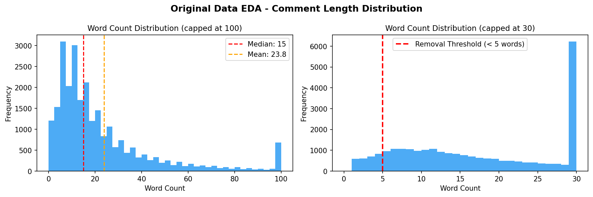
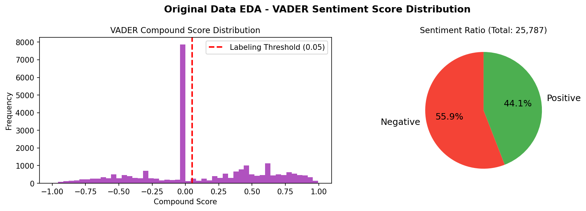
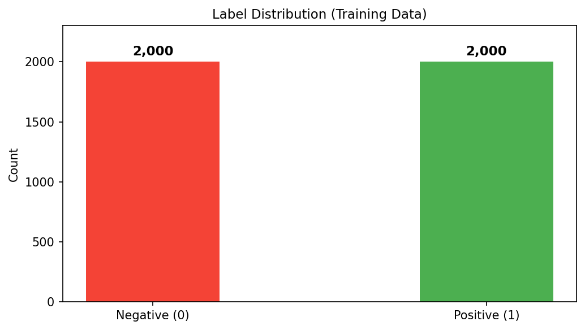
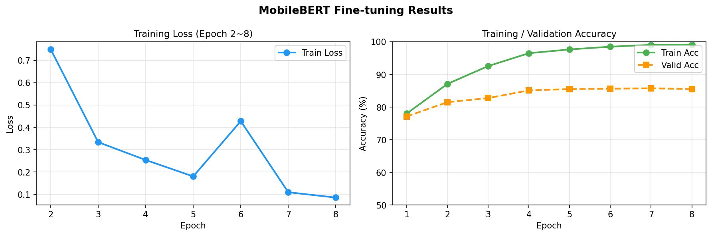
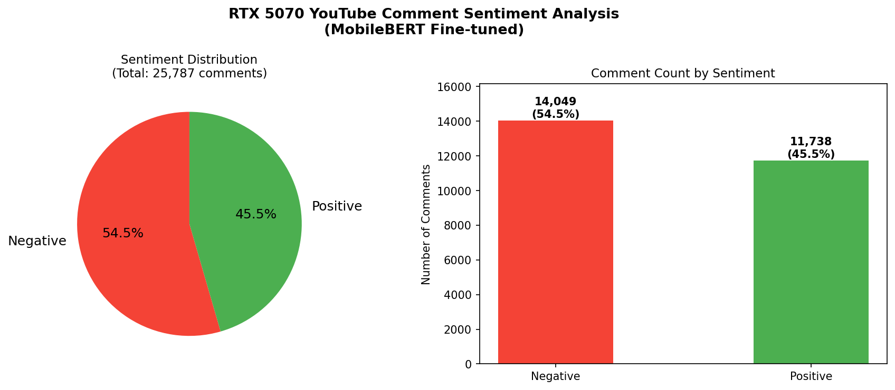
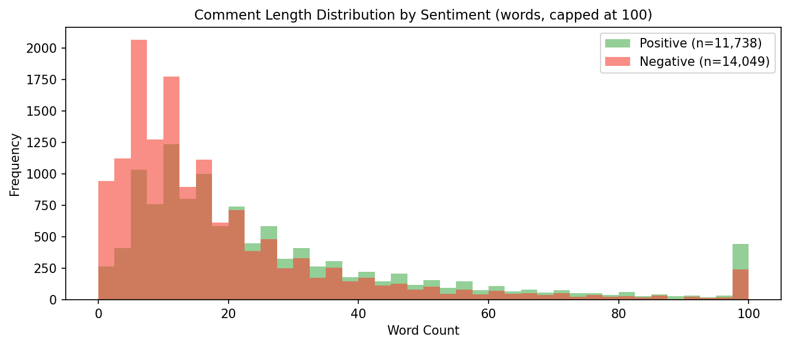

# MobileBERT를 활용한 RTX 5070 소비자 반응 분석 프로젝트

---

## 1. 개요

### 1.1 문제 인식

2025년 NVIDIA가 출시한 RTX 5070은 이전 세대 플래그십인 RTX 4090 수준의 성능을 절반 가격에 제공한다는 마케팅 주장으로 출시 전부터 소비자들의 높은 관심을 받았다. 그러나 실제 출시 이후 소비자 반응은 크게 엇갈렸다. AI 기반 프레임 생성 기술(DLSS 4, Frame Generation)에 대한 "가짜 프레임(Fake Frames)" 논란, AMD RX 9070 XT와의 가격 대비 성능 비교, VRAM 용량 논란 등 다양한 이슈가 온라인에서 활발하게 논의되었다.

그래픽카드는 수십만 원에서 수백만 원에 이르는 고가의 소비재로, 소비자들의 구매 결정에 온라인 여론이 큰 영향을 미친다. 특히 유튜브 리뷰 영상의 댓글은 실제 구매자 및 잠재 소비자들의 솔직한 의견이 담겨 있어 제품에 대한 실질적인 여론을 파악하는 데 유용한 데이터 소스이다.

### 1.2 프로젝트 목표

본 프로젝트에서는 RTX 5070 관련 유튜브 영상의 댓글 데이터를 직접 수집하고 **MobileBERT를 파인튜닝**하여 소비자 반응을 긍정/부정으로 분류함으로써, 실제 소비자 인식을 데이터 기반으로 파악하고자 한다. 이를 통해 NVIDIA의 마케팅 주장과 실제 소비자 경험 사이에 괴리가 있는지 확인한다.

### 1.3 실행 환경

| 항목 | 내용 |
|------|------|
| OS | Windows 11 |
| GPU | NVIDIA RTX 4070 (CUDA) |
| Python | 3.10 |
| 주요 라이브러리 | torch, transformers, pandas, nltk, matplotlib |

---

## 2. 데이터 수집 (youtube.py)

### 2.1 크롤링 절차

| 단계 | 내용 |
|------|------|
| 1 | youtube-comment-downloader 라이브러리를 활용하여 유튜브 댓글 수집 |
| 2 | RTX 5070 관련 리뷰 및 비교 영상 22개를 수집 대상으로 선정 |
| 3 | 각 영상의 댓글을 최신순(SORT_BY_RECENT)으로 수집 |
| 4 | 목표 건수(30,000건) 달성 시 수집 중단 |
| 5 | 댓글 텍스트(comment), 좋아요 수(likes), 날짜(date)를 rtx5070.csv로 저장 |

### 2.2 수집 대상 영상

Linus Tech Tips, GamersNexus, Hardware Unboxed 등 주요 테크 유튜브 채널의 RTX 5070 리뷰 영상 및 RTX 5070 vs AMD RX 9070 XT 비교 영상 등 총 22개 영상을 대상으로 하였다.

### 2.3 수집 결과

| 항목 | 내용 |
|------|------|
| 총 수집 댓글 수 | 25,787개 |
| 수집 컬럼 | comment, likes, date |
| 저장 파일 | rtx5070.csv |

> 목표 수집량 3만 건 대비 25,787건이 수집되었으며, 일부 영상의 댓글 수 부족으로 목표치에 미달하였다.

### 2.4 수집 데이터 샘플

| # | 댓글 텍스트 (원문) |
|---|----------------|
| 1 | Proud owner of a 5070 right here. This card definitely serves its purpose. |
| 2 | I'll keep my 4090 over even a 5090 unless you don't mind trading real frames for fake ones |
| 3 | I'm editing fhd & 4k video. I'm crazy disappointed with this card. |
| 4 | so switching from a 1650 to a 5070 is good or nah? |
| 5 | Fake Frames real Flames |

---

## 3. 원본 데이터 탐색적 분석 EDA (eda.py)

수집된 원본 데이터(rtx5070.csv)에 대해 전처리 전 탐색적 분석을 수행하였다.

### 3.1 댓글 길이 분포

| 항목 | 값 |
|------|------|
| 총 댓글 수 | 25,787개 |
| 평균 댓글 길이 | 23.8단어 |
| 중앙값 | 15단어 |
| 최대 댓글 길이 | 1,013단어 |
| 5단어 미만 댓글 | 2,739개 (10.6%) |

댓글 길이는 5~20단어 사이에 집중되어 있으며, 일부 매우 긴 댓글(100단어 이상)도 존재한다. 5단어 미만의 짧은 댓글은 감성 분석에 의미 있는 정보를 포함하기 어렵다고 판단하여 전처리 단계에서 제거하였다.

### 3.2 VADER 감성 점수 분포

compound score 0 부근에 데이터가 집중되어 있으며, 0.05를 라벨링 기준으로 설정하였다. 긍정(44.1%)과 부정(55.9%)의 분포를 확인할 수 있다. 점수가 0 근처에 몰린 것은 유튜브 댓글 특성상 중립적인 표현이 많기 때문으로 해석된다.

---

## 4. 데이터 전처리 및 분석 대상 데이터 구축 (extract_train_data.py)

### 4.1 전처리 과정

원본 데이터에 대해 다음과 같은 전처리를 수행하였으며, 전처리 완료 후 남은 데이터를 **분석 대상 데이터**로 정의하였다.

| 단계 | 내용 | 데이터 수 |
|------|------|---------|
| 원본 데이터 | 수집된 전체 댓글 | 25,787개 |
| 빈 댓글 제거 | dropna 처리 | - |
| 문장 길이 제한 | 5단어 미만 댓글 제거 | 23,048개 |
| **분석 대상 데이터** | **전처리 완료 데이터** | **23,048개** |

### 4.2 학습 데이터 추출

분석 대상 데이터(23,048개)에서 긍정/부정 클래스 불균형을 해소하기 위해 각 클래스별 균등 추출을 수행하였다. 긍정과 부정 각 2,000개씩 총 4,000개를 학습 데이터로 구축하고 8:2 비율로 학습/검증 데이터를 분리하였다.

위 차트에서 확인할 수 있듯이 긍정(1)과 부정(0)이 각 2,000개로 완벽하게 균형을 이루고 있다. 균형 잡힌 학습 데이터는 모델이 특정 클래스에 편향되지 않고 긍정/부정을 균형 있게 학습하도록 한다.

| 구분 | 건수 |
|------|------|
| 분석 대상 데이터 | 23,048개 |
| 학습 데이터 - 긍정(1) | 2,000개 |
| 학습 데이터 - 부정(0) | 2,000개 |
| **총 학습 데이터** | **4,000개** |
| 학습 데이터 (80%) | 3,200개 |
| 검증 데이터 (20%) | 800개 |

---

## 5. 데이터 라벨링 (auto_label.py)

수집한 댓글에는 정답 라벨이 없으므로 2단계 라벨링을 수행하였다.

### 5.1 1단계: VADER 자동 라벨링

VADER(Valence Aware Dictionary and sEntiment Reasoner)는 영어 텍스트에 최적화된 규칙 기반 감성 분석 도구로, 소셜 미디어 및 짧은 텍스트에서 높은 성능을 보인다.

| 조건 | 라벨 |
|------|------|
| VADER compound score ≥ 0.05 | 1 (긍정, Positive) |
| VADER compound score < 0.05 | 0 (부정, Negative) |

### 5.2 2단계: 키워드 기반 라벨 검수 및 수정

VADER 자동 라벨링 후, RTX 5070 소비자 반응 맥락에 특화된 긍정/부정 키워드를 활용하여 라벨을 검토 및 수정하였다. VADER가 맥락을 제대로 반영하지 못하는 경우(예: "fake frames", "regret" 등 GPU 특화 부정 표현)를 보완하기 위한 과정이다.

| 구분 | 키워드 예시 |
|------|-----------|
| 긍정 키워드 | love, great, amazing, worth it, satisfied, recommend, beast, smooth, works great 등 |
| 부정 키워드 | disappointed, overpriced, fake frame, waste, regret, return, terrible, scam, avoid 등 |

### 5.3 라벨링 결과 분석

| 항목 | 건수 |
|------|------|
| 전체 댓글 | 25,787개 |
| 1단계 VADER 라벨링 후 긍정(1) | 11,369개 (44.1%) |
| 1단계 VADER 라벨링 후 부정(0) | 14,418개 (55.9%) |
| 2단계 키워드로 수정된 라벨 | 1,261개 (4.9%) |
| **최종 긍정(1)** | **11,580개 (44.9%)** |
| **최종 부정(0)** | **14,207개 (55.1%)** |

전체 댓글의 55.1%가 부정으로 라벨링되어 부정 댓글이 다소 우세한 것을 확인할 수 있다. 이는 RTX 5070의 출시 초기 마케팅 논란과 스펙 논쟁이 반영된 결과로 해석된다.

---

## 6. MobileBERT 모델 학습 (MobileBERT-FineTune.py)

### 6.1 토큰화

| 구분 | 설명 |
|------|------|
| 토크나이저 | google/mobilebert-uncased |
| 최대 토큰 길이 | 512 |
| 패딩 방식 | max_length |
| 특수 토큰 | [CLS], [SEP] 추가 |

### 6.2 모델 설정

| 항목 | 설정값 |
|------|--------|
| 기반 모델 | google/mobilebert-uncased |
| 분류 클래스 | 2개 (긍정 / 부정) |
| 배치 크기 | 8 |
| Epoch | 8 |
| 학습률 (lr) | 2e-5 |
| 옵티마이저 | AdamW |
| 스케줄러 | Linear Warmup Scheduler |
| 학습 / 검증 비율 | 8 : 2 |
| 학습 환경 | NVIDIA RTX 4070 (CUDA) |

### 6.3 학습 결과

| Epoch | 학습 오차 (Loss) | 학습 정확도 | 검증 정확도 |
|-------|----------------|------------|------------|
| 1 | 102455.0518 | 78.00% | 77.12% |
| 2 | 0.7496 | 87.09% | 81.50% |
| 3 | 0.3339 | 92.56% | 82.75% |
| 4 | 0.2541 | 96.50% | 85.12% |
| 5 | 0.1807 | 97.66% | 85.50% |
| 6 | 0.4280 | 98.50% | 85.62% |
| **7** | **0.1099** | **99.06%** | **85.75%** |
| 8 | 0.0861 | 99.16% | 85.50% |

Epoch 7에서 검증 정확도 **85.75%** 로 최고치를 기록하였다. Epoch 1의 Loss가 비정상적으로 높은 것은 사전학습 모델이 초기 학습 데이터에 적응하는 과정에서 발생하는 현상으로, Epoch 2부터 급격히 안정화된다. 학습 정확도와 검증 정확도의 차이가 약 13% 수준으로, 일정 수준의 과적합이 발생하였으나 검증 정확도가 꾸준히 상승하여 학습이 안정적으로 진행되었다.

---

## 7. 소비자 반응 분석 결과 (analyze.py)

학습된 MobileBERT 모델로 전체 분석 대상 데이터 25,787개에 대해 감성 분류(Inference)를 수행한 결과는 다음과 같다.

### 7.1 전체 감성 분포

| 구분 | 댓글 수 | 비율 |
|------|---------|------|
| 긍정 (Positive) | 11,738개 | 45.5% |
| 부정 (Negative) | 14,049개 | 54.5% |
| **합계** | **25,787개** | **100%** |

### 7.2 감성별 댓글 길이 분포

긍정과 부정 모두 5~20단어 사이의 짧은 댓글이 가장 많으며, 부정 댓글의 경우 긍정 댓글에 비해 장문 댓글의 비율이 상대적으로 높다. 이는 부정적인 의견을 가진 소비자일수록 구체적인 불만 이유를 상세히 서술하는 경향이 있음을 시사한다.

### 7.3 결과 해석

전체 댓글의 **54.5%가 부정적** 반응으로 분류되어, RTX 5070에 대한 소비자 여론은 부정적인 의견이 다소 우세한 것으로 나타났다.

**주요 부정 반응:**
- **"Fake Frames"** — AI 기반 프레임 생성(DLSS 4, Frame Generation)에 대한 불신
- **AMD RX 9070 XT 비교** — 가격 대비 성능에서 AMD가 유리하다는 의견
- **VRAM / ROPs 스펙 논란** — 실제 스펙이 기대에 미치지 못한다는 비판
- **마케팅 과장** — "4090 수준의 성능"이라는 주장에 대한 회의적 시각

**주요 긍정 반응:**
- MSRP($549) 수준에서 구매 성공 시 높은 가격 대비 만족도
- DLSS 4 및 Frame Generation 기술을 활용한 실사용 성능에 대한 긍정적 평가
- NVIDIA 생태계(드라이버 안정성, 소프트웨어 지원) 선호

---

## 8. 결론

RTX 5070 관련 유튜브 댓글 25,787개를 수집하고 MobileBERT 파인튜닝(검증 정확도 85.75%)을 통해 소비자 반응을 분석한 결과, 부정적 반응(54.5%)이 긍정적 반응(45.5%)보다 소폭 높게 나타났다.

서론에서 제기한 "NVIDIA의 마케팅 주장과 실제 소비자 경험 사이의 괴리"에 대해, 분석 결과 소비자들의 부정적 여론이 우세하여 "RTX 4090 수준의 성능"이라는 마케팅 주장이 실제 소비자 만족도로 이어지지 않았음을 확인할 수 있었다. 특히 AI 기반 프레임 생성 기술에 대한 불신과 AMD RX 9070 XT와의 가격 대비 성능 논란이 부정 여론 형성에 큰 영향을 미친 것으로 분석된다.

---

## 9. 한계점 및 개선 방향

- **데이터 수집 확대:** 목표 수집량 3만 건 대비 25,787건이 수집되었으며, 향후 추가 수집으로 보완 가능하다.
- **라벨링 품질 향상:** VADER 자동 라벨링 특성상 은어, 반어적 표현 처리에 한계가 있으며, 키워드 기반 2차 검수를 수행하였으나 맥락을 완전히 반영하지 못하는 경우가 존재한다. GPT/Claude 기반 라벨링으로 개선 가능하다.
- **검증 정확도 개선:** 학습 데이터 증가 및 하이퍼파라미터 튜닝을 통해 검증 정확도를 추가로 향상시킬 수 있다.
- **Topic Modelling 추가:** LDA 등 토픽 모델링을 통해 부정 댓글의 주요 이슈를 구체적으로 파악할 수 있다.
